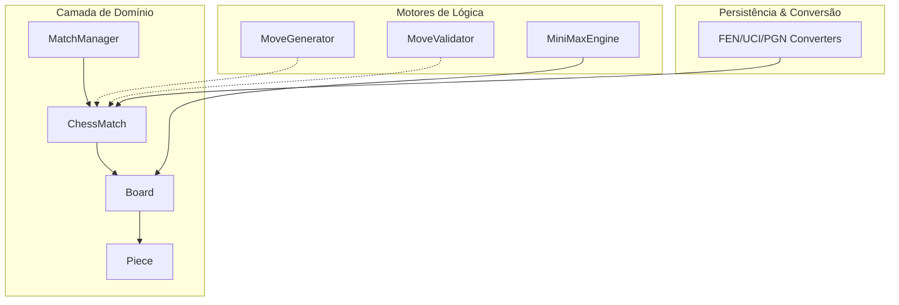

# ♟️ Lib Chess

> **Uma biblioteca Java 21+ robusta, imutável e performática para lógica de xadrez.**

[](https://www.java.com)
[](LICENSE)

**Lib Chess** foi projetada para ser o coração de qualquer aplicação de xadrez moderna. Construída com foco em **Imutabilidade Total** e **Domain-Driven Design**, ela garante que o estado do jogo seja previsível, thread-safe e fácil de depurar.

---

## 📖 Documentação Detalhada

Para uma exploração profunda da biblioteca, confira nossos guias:

* [💎 Conceitos Centrais & Imutabilidade](docs/CORE_CONCEPTS.md) - Por que usamos Records e como funciona o Perft.
* [🧠 Guia da Inteligência Artificial](docs/AI_GUIDE.md) - Entenda o motor Minimax e a Poda Alpha-Beta.

---

## 🏗️ Arquitetura Visual



---

## 🚀 Instalação

Adicione a dependência ao seu `pom.xml` (ajuste conforme seu repositório local):

```xml
<dependency>
    <groupId>com.bill</groupId>
    <artifactId>chess</artifactId>
    <version>1.0.0</version>
</dependency>
```

---

## 🛠️ Exemplo de Uso Rápido

### 1. Movimentação com Histórico (Undo/Redo)

```java
// Iniciar partida padrão
var manager = new MatchManager(ChessFactory.create());

// Mover e4
var move = MoveFactory.fromUci("e2e4", manager.getCurrentMatch().board());
manager.applyMove(move);

// Desfazer o lance
manager.undo();
```

### 2. Desafiar a IA

```java
var engine = new MiniMaxEngine(3);
var bestMove = engine.findBestMove(match.board(), Color.BLACK);
```

---

## 🌟 Funcionalidades Principais

* [x] **Regras Internacionais**: Roque, En Passant e Promoção automáticos.
* [x] **Undo/Redo Infinito**: Sistema de histórico baseado em estados imutáveis.
* [x] **Validação Perft**: Verificada exaustivamente contra os maiores engines do mundo.
* [x] **Suporte Total**: FEN para posições, PGN para histórico e UCI para comunicação.
* [x] **IA Nativa**: Minimax com Poda Alpha-Beta e Quiescence Search.

---

## 🗺️ Roadmap Criativo

* [ ] **Interface Web**: Exemplo pronto com Spring Boot + WebSockets.
* [ ] **Multi-threading**: Busca paralela no MiniMaxEngine.
* [ ] **Bitboards**: Refatoração interna para máxima performance.

---

## 🤝 Contribuindo

Sinta-se à vontade para abrir Issues ou Pull Requests. Lembre-se de rodar os testes Perft antes de submeter alterações na lógica de movimentos:
`./mvnw test`

---

## 📄 Licença

Este projeto está licenciado sob a Licença MIT - veja o arquivo [LICENSE](LICENSE) para detalhes.
